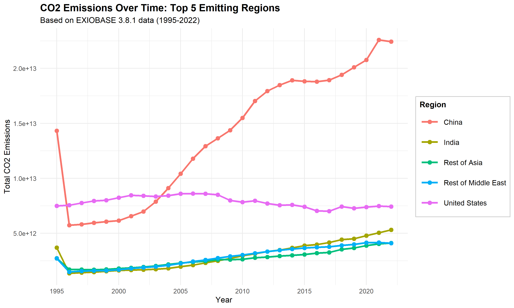
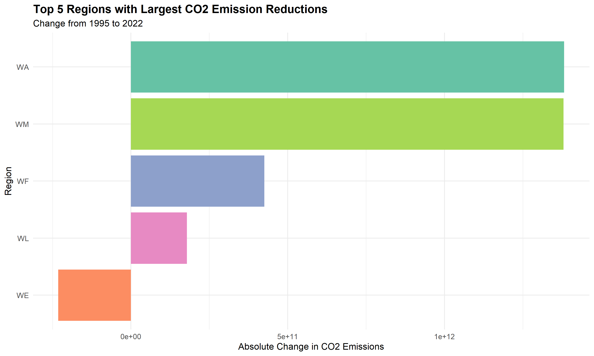
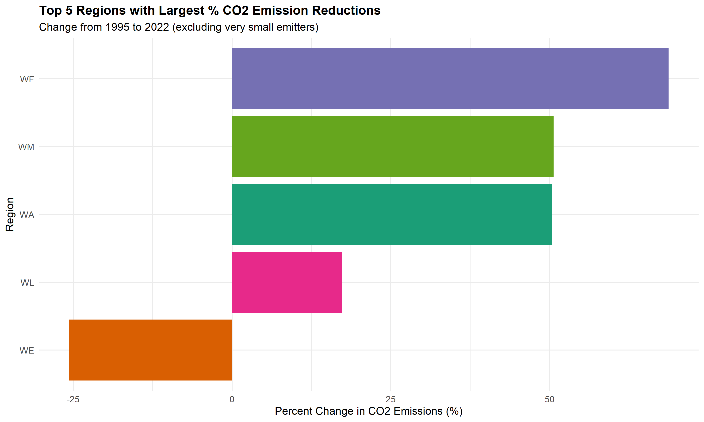
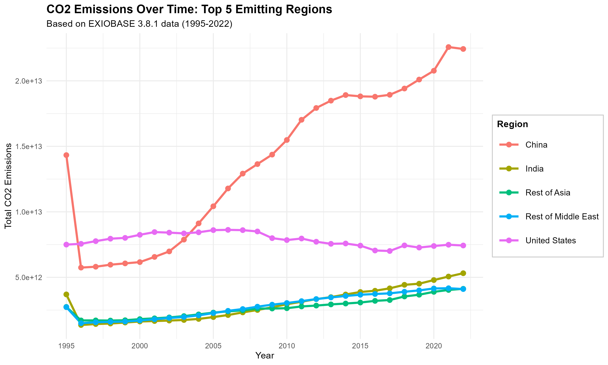

# ⚓ Module 1: Tabular Data - A Pirate's Tale 🏴‍☠️
[Team website](https://https://espm-288.github.io/module-1-madi_savanna/tabular-data.html)
Working with larger-than-RAM data using duckdbfs

## 🗺️ Ahoy, Me Hearties! (Overview)

Avast ye! This here treasure map demonstrates high-performance workflows fer wranglin' tabular data usin' DuckDB and duckdbfs, arr! We be handlin' datasets larger than the hold of the Black Pearl through streamin' and remote file access capabilities, savvy? ⛵

## 🌊 Case Study: Global Supply Chains o' the Seven Seas

This module be usin' [EXIOBASE 3.8.1](https://source.coop/youssef-harby/exiobase-3), a mighty global Multi-Regional Input-Output (MRIO) database that tracks economic transactions between sectors and regions, along with their environmental plunder! 💰

### 🏝️ Treasure Details (Dataset Details)
- **Coverage**: 44 countries + 5 rest-of-world regions across the seven seas! 🌍
- **Timeframe**: 1995–2022 (many a year o' plunderin'!) ⏰
- **Content**: Economic transactions (Z matrix), final demand (Y matrix), and environmental stressors (F matrix) - all the booty ye need! 📊
- **Format**: Cloud-optimized Parquet, partitioned by year and matrix type (organized like a proper ship's cargo!) 📦

## 🎓 What Ye'll Learn on This Voyage (Learning Objectives)

- Connect to remote datasets without downloadin' - like sendin' yer spyglass across the seas! 🔭
- Filter data efficiently before loadin' into R - only take the treasure ye need! 💎
- Query large tabular datasets using dplyr syntax - navigate the data like a seasoned sailor! 🧭
- Analyze economic and environmental data from EXIOBASE - understand the bounty and the cost! ⚖️

## 📜 Ye Olde Files

- `tabular-data.qmd` - Main Quarto scroll with exercises and analysis, arr! 🗞️

## ⚔️ Required Tools fer the Voyage (Requirements)

- R 4.0+ (A proper captain's toolkit! ⚓)
- duckdbfs package (Yer trusty compass! 🧭)
- dplyr package (Yer sword fer data wranglin'! ⚔️)

```r
library(duckdbfs)  # Yer trusty compass! 🧭
library(dplyr)     # Yer sword fer data wranglin'! ⚔️
```

## 🚢 Settin' Sail - Gettin' Started

Open `tabular-data.qmd` in RStudio or Quarto and render the document to see the analysis and exercises, ye scurvy dog! 🦜

Shiver me timbers and may the wind be at yer back! 🌬️

## 🏴‍☠️ Captain o' This Ship

ESPM 288 - Module 1 ⚓👑


(mic check) hello world, its brunjo 
ahoy! I redeemed ye file


This is Madi doing a bit of makeup work for Monday!!
I think this is what you all tried doing in class, I'll check with the rest of the team tomorrow!

## 📊 Visualizations

### CO2 Emissions Over Time: Top 5 Emitting Regions



This plot shows the CO2 emissions trends for the top 5 emitting regions from 1995 to 2022.

### Top 5 Regions with Largest CO2 Emission Reductions



This bar chart displays the regions with the largest absolute reductions in CO2 emissions between 1995 and 2022.

### Top 5 Regions with Largest Percentage CO2 Emission Reductions



This chart shows the regions with the largest percentage reductions in CO2 emissions (excluding very small emitters).

### All Top Regions Time Series



Comprehensive time series showing CO2 emissions for all top emitting regions over time.

---

## Exercise 3: CO2 Emissions Over Time by Country (Top 5 Emitters)

First, let's identify the top 5 CO2 emitting countries in 2022:

```{r}
# Find the top 5 emitting countries in 2022
top_emitters_2022 <- exio |>
    filter(year == 2022,
           matrix == "F_satellite",
           stressor %like% "%CO2%") |>
    group_by(region) |>
    summarise(total_co2 = sum(value, na.rm = TRUE)) |>
    filter(!grepl("^W", region)) |>  # Exclude rest-of-world regions
    arrange(desc(total_co2)) |>
    head(5) |>
    collect()

top_emitters_2022
```

Now, let's get the time series data for these top 5 countries across all years:

```{r}
# Get the list of top 5 countries
top_5_countries <- top_emitters_2022$region

# Query CO2 emissions for these countries across all years
co2_timeseries <- exio |>
    filter(matrix == "F_satellite",
           stressor %like% "%CO2%",
           region %in% top_5_countries) |>
    group_by(year, region) |>
    summarise(total_co2 = sum(value, na.rm = TRUE)) |>
    arrange(year, region) |>
    collect()

# View the data
head(co2_timeseries, 20)
```

Create a line plot showing CO2 emissions over time for the top 5 countries:

```{r}
# Create a mapping of region codes to full names
region_names <- c(
    "CN" = "China",
    "US" = "United States",
    "IN" = "India",
    "RU" = "Russia",
    "JP" = "Japan",
    "DE" = "Germany",
    "GB" = "United Kingdom",
    "KR" = "South Korea",
    "CA" = "Canada",
    "BR" = "Brazil",
    "WE" = "Rest of Europe",
    "WA" = "Rest of Asia",
    "WF" = "Rest of Africa",
    "WL" = "Rest of Latin America",
    "WM" = "Rest of Middle East"
)

# Add full region names to the data
co2_timeseries <- co2_timeseries |>
    mutate(region_name = ifelse(region %in% names(region_names), 
                                 region_names[region], 
                                 region))

# Create the time series plot
ggplot(co2_timeseries, aes(x = year, y = total_co2, color = region_name)) +
    geom_line(linewidth = 1.2) +
    geom_point(size = 2.5) +
    labs(
        title = "CO2 Emissions Over Time: Top 5 Emitting Countries",
        subtitle = "Based on EXIOBASE 3.8.1 data (1995-2022)",
        x = "Year",
        y = "Total CO2 Emissions",
        color = "Country/Region"
    ) +
    theme_minimal() +
    theme(
        plot.title = element_text(face = "bold", size = 14),
        legend.position = "right",
        legend.title = element_text(face = "bold", size = 11),
        legend.text = element_text(size = 10),
        legend.background = element_rect(fill = "white", color = "gray80"),
        legend.key.size = unit(1, "cm")
    ) +
    scale_x_continuous(breaks = seq(1995, 2022, by = 5))
```

## Exercise 4: Countries with Largest CO2 Emission Reductions 
This is just me trying something for fun to see what I can do here!!
Let's identify which countries have reduced their CO2 emissions the most between 1995 and 2022:

```{r}
# Get CO2 emissions for all countries in 1995 and 2022
co2_1995 <- exio |>
    filter(year == 1995,
           matrix == "F_satellite",
           stressor %like% "%CO2%") |>
    group_by(region) |>
    summarise(co2_1995 = sum(value, na.rm = TRUE)) |>
    collect()

co2_2022 <- exio |>
    filter(year == 2022,
           matrix == "F_satellite",
           stressor %like% "%CO2%") |>
    group_by(region) |>
    summarise(co2_2022 = sum(value, na.rm = TRUE)) |>
    collect()

# Join the two datasets and calculate change
co2_change <- co2_1995 |>
    inner_join(co2_2022, by = "region") |>
    mutate(
        absolute_change = co2_2022 - co2_1995,
        percent_change = ((co2_2022 - co2_1995) / co2_1995) * 100
    ) |>
    filter(!grepl("^W", region)) |>  # Exclude rest-of-world regions (WA, WE, WF, WL, WM)
    arrange(absolute_change)

# View countries with the largest absolute decreases
head(co2_change, 5)
```

Now let's visualize the top 5 countries with the largest absolute reductions:

```{r}
# Get top 5 reducers
top_reducers <- co2_change |>
    head(5)

# Create a bar plot
ggplot(top_reducers, aes(x = reorder(region, absolute_change), y = absolute_change, fill = region)) +
    geom_col() +
    coord_flip() +
    scale_fill_brewer(palette = "Set2") +
    labs(
        title = "Top 5 Countries with Largest CO2 Emission Reductions",
        subtitle = "Change from 1995 to 2022",
        x = "Country",
        y = "Absolute Change in CO2 Emissions"
    ) +
    theme_minimal() +
    theme(
        plot.title = element_text(face = "bold", size = 14),
        legend.position = "none"
    )
```

Let's also look at percentage reductions (excluding countries with very low baseline emissions):

```{r}
# Filter to countries with substantial 1995 emissions (>1000 units) to avoid outliers
substantial_emitters <- co2_change |>
    filter(co2_1995 > 1000) |>
    arrange(percent_change) |>
    head(5)

substantial_emitters

# Visualize percentage reductions
ggplot(substantial_emitters, aes(x = reorder(region, percent_change), y = percent_change, fill = region)) +
    geom_col() +
    coord_flip() +
    scale_fill_brewer(palette = "Dark2") +
    labs(
        title = "Top 5 Countries with Largest % CO2 Emission Reductions",
        subtitle = "Change from 1995 to 2022 (excluding very small emitters)",
        x = "Country",
        y = "Percent Change in CO2 Emissions (%)"
    ) +
    theme_minimal() +
    theme(
        plot.title = element_text(face = "bold", size = 13),
        legend.position = "none"
    )
```

## Exercise 5: CO2 Emissions Over Time for Top 5 Regions

Now let's look at regions (including rest-of-world aggregates) instead of just countries:

```{r}
# Find the top 5 emitting regions in 2022 (including W regions)
top_regions_2022 <- exio |>
    filter(year == 2022,
           matrix == "F_satellite",
           stressor %like% "%CO2%") |>
    group_by(region) |>
    summarise(total_co2 = sum(value, na.rm = TRUE)) |>
    arrange(desc(total_co2)) |>
    head(5) |>
    collect()

top_regions_2022
```

Get time series data for these top 5 regions across all years:

```{r}
# Get the list of top 5 regions
top_5_regions <- top_regions_2022$region

# Query CO2 emissions for these regions across all years
co2_regions_timeseries <- exio |>
    filter(matrix == "F_satellite",
           stressor %like% "%CO2%",
           region %in% top_5_regions) |>
    group_by(year, region) |>
    summarise(total_co2 = sum(value, na.rm = TRUE)) |>
    arrange(year, region) |>
    collect()

# View the data
head(co2_regions_timeseries, 20)
```

Create a line plot showing CO2 emissions over time for the top 5 regions:

```{r}
# Add full region names to the data
co2_regions_timeseries <- co2_regions_timeseries |>
    mutate(region_name = ifelse(region %in% names(region_names), 
                                 region_names[region], 
                                 region))

# Create the time series plot
ggplot(co2_regions_timeseries, aes(x = year, y = total_co2, color = region_name)) +
    geom_line(linewidth = 1.2) +
    geom_point(size = 2.5) +
    labs(
        title = "CO2 Emissions Over Time: Top 5 Emitting Regions",
        subtitle = "Based on EXIOBASE 3.8.1 data (1995-2022)",
        x = "Year",
        y = "Total CO2 Emissions",
        color = "Region"
    ) +
    theme_minimal() +
    theme(
        plot.title = element_text(face = "bold", size = 14),
        legend.position = "right",
        legend.title = element_text(face = "bold", size = 11),
        legend.text = element_text(size = 10),
        legend.background = element_rect(fill = "white", color = "gray80"),
        legend.key.size = unit(1, "cm")
    ) +
    scale_x_continuous(breaks = seq(1995, 2022, by = 5))
```

I ran this in my tabular-data file and it looks good (I think haha)!! I also pushed the plots to github :))
